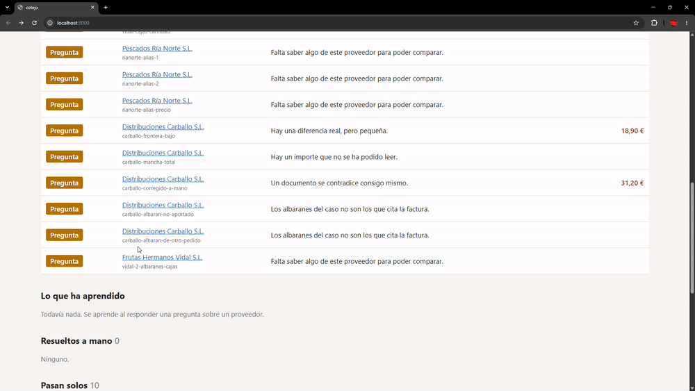

# cotejo

**Concilia el albarán de un proveedor con su factura y decide una de tres cosas: pasa
solo, pregunta a una persona, o escala porque hay dinero de por medio.**

Sacar los campos de un PDF es la parte fácil. Lo difícil es decidir a quién creer cuando
dos documentos se contradicen, y saber cuándo preguntar en vez de adivinar. Este proyecto
va de eso.

### Qué tiene dentro

- **Cuatro señales.** Cada regla declara de quién es el problema: `discrepancy` (los dos
  documentos no dicen lo mismo), `inconsistency` (un documento se contradice a sí mismo),
  `read-doubt` (no me creo lo que he leído) y `missing-knowledge` (me falta un dato del
  proveedor). Un modelo mejor arregla la tercera; no arregla la segunda.
- **Aprende de una corrección.** Resolver una pregunta guarda un hecho que el pipeline
  vuelve a leer, atado al NIF del proveedor, con fecha y revocable.
- **Eval con holdout.** Casos que comparten el hecho aprendido pero que nadie corrige a
  mano: pasan de 0 de 4 a 4 de 4, y dos destapan un cobro de más que antes quedaba
  enterrado dentro de una pregunta sobre unidades.
- **Observabilidad real.** Una traza por caso en Langfuse, con spans por etapa, coste por
  llamada y las resoluciones humanas como scores.
- **El modelo hace dos cosas**, leer y redactar la pregunta. Cruzar, detectar y decidir es
  código determinista, con tests.
- **La pregunta se valida.** La redacta un modelo, pero si menciona una cifra que no está
  en los findings no se publica y cae a plantilla.

### Dos ficheros que merece la pena abrir

- [`DECISIONS.md`](DECISIONS.md) — todas las decisiones de diseño con su porqué, incluidos
  los errores: un falso positivo en mi propia comprobación aritmética, y una conclusión
  que retiré porque las dos mediciones no eran comparables.
- [`prompts.md`](prompts.md) — los prompts con los que dirigí el desarrollo. El código lo
  escribió en gran parte un agente; la arquitectura y los límites, no.

> El dataset es sintético y generado por mí, así que las métricas son un techo optimista:
> mi generador y mi extractor comparten supuestos.